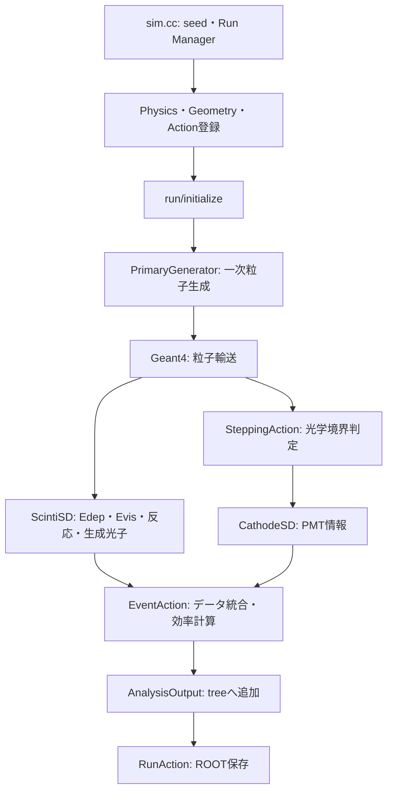

# TRIUMF 2023 detector simulation

## 1. 概要

TRIUMF 2023実験で使用する検出器系をGeant4で再現し、粒子相互作用、シンチレーション光の生成・輸送、PMT光電面での検出を評価するシミュレーションである。

Li-glass、UROKO、HILE、HPGe、β線用プラスチックシンチレータと周辺構造物を実装している。現在は、**UROKO,Li-glass**についてテストできる。
一次粒子はマクロの `/mygen/sourceType` で選択する。但し、エネルギーについては、その都度変更してシミュレーションすることを想定している

| 設定値 | 粒子・初期条件 |
|---|---|
| `neutron` | 0.5 MeV中性子、等方的 |
| `electron` | 50 keV電子、等方的 |
| `gamma` | 2.3 MeV γ線、等方的 |
| `gamma(137Cs)` | 0.661660 MeV γ線、等方的 |
| `137Cs`、`90Sr`、`90Y` | 対応する静止イオン |

物理リストは `FTFP_BERT_HP` を基礎として、Livermore電磁相互作用、放射性崩壊、光学過程を登録している。

## 2. 実行環境

確認済み環境はLinux x86_64、Geant4 11.2.2、CMake 3.31.8、GCC 14.3.1である。`ui_all` と `vis_all` を使用する。解析用ROOTマクロには別途ROOT環境が必要である。

```bash
cmake -S . -B build
cmake --build build
```

ログを含めた推奨実行方法：

```bash
./scripts/run_with_log.sh ./build/sim ./build/run_neutron.mac
```

`run_electron.mac`、`run_gamma.mac` も選択可能である。結果は `root/<run label>.root`、実行条件は `logs/<run label>/` に保存する。引数なしで起動した場合は対話モードとなり、UI上で `/control/execute vis.mac` を実行すると可視化できる。

## 3. 取得できる物理量

ROOTファイル内の `tree` に、**1イベント・1 PMTチャンネルにつき1行** 保存する。

| 分類 | ブランチ | 内容 |
|---|---|---|
| 識別 | `RunID`、`EventID` | Run・イベント番号 |
| 識別 | `DetectorCopyNo`、`PmtCopyNo` | 検出器・PMT番号 |
| 識別 | `IsDetectorRepresentative` | PMT 0の行なら1 |
| エネルギー | `ScintiEdep`、`ScintiEvis` | 総付与エネルギー・可視エネルギー |
| 発光 | `GeneratedPhotons` | シンチレーション生成光子数 |
| 中性子 | `NeutronInteractionCount` | 一次中性子のhadronic相互作用回数 |
| 初回反応 | `FirstHitTime` | 最初の一次中性子hadronic相互作用時刻 |
| 初回反応 | `FirstHitGlobalX/Y/Z` | ワールド座標 |
| 初回反応 | `FirstHitLocalX/Y/Z`、`FirstHitRadius` | ローカル座標と半径 |
| PMT | `ArrivedPhotons`、`DetectedPhotons` | 到達・検出光子数 |
| PMT | `ArrivalEfficiency`、`DetectionEfficiency` | PMT単体の効率 |
| PMT合計 | `PmtSumArrivedPhotons`、`PmtSumDetectedPhotons` | 検出器内の全PMT合計 |
| PMT合計 | `PmtSumArrivalEfficiency`、`PmtSumDetectionEfficiency` | 検出器全体の効率 |
| 光子別 | `HitTimes`、`HitPosX/Y/Z` | 各検出光子の時刻・ワールド座標 |

`GeneratedPhotons == 0` の場合、効率は0となる。単位変換せず保存しており、エネルギーはMeV、時刻はns、位置はmmとして扱う。

## 4. simulation時のプログラムの流れ



1. `sim.cc` が乱数、Run Manager、物理リスト、検出器、Actionを登録する。
2. `/run/initialize` でジオメトリとSensitive Detectorを構築する。
3. `PrimaryGenerator` がイベントごとに原点から一次粒子を1個生成する。
4. `ScintiSD` がエネルギー付与、可視エネルギー、生成光子、中性子反応を集計する。
5. `SteppingAction` が光学境界の `Detection` を判定し、`CathodeSD` がPMT別の時刻と位置を記録する。
6. `EventAction` が両SDの情報を統合し、`AnalysisOutput` を介してROOTへ保存する。

## 5. 各ファイルの役割（.cc）

### 制御・データ取得

| ファイル | 役割 |
|---|---|
| `sim.cc` | エントリーポイント、乱数、MT、可視化、マクロ実行 |
| `ActionInitialization.cc` | User Actionの登録 |
| `PhysicsList.cc` | 使用する物理過程の登録 |
| `RunConfig.cc` | 粒子源設定の保持 |
| `PrimaryGenerator.cc` / `PrimaryGeneratorMessenger.cc` | 一次粒子生成 / UIコマンド |
| `RunAction.cc` / `AnalysisOutput.cc` | ROOTファイル管理 / tree定義・書き込み |
| `EventAction.cc` | SDデータの統合と効率計算 |
| `SteppingAction.cc` | 光学境界の検出判定 |
| `DetectorConstruction.cc` | World、検出器、周辺構造物、SDの構築 |
| `ScintiSD.cc` / `CathodeSD.cc` | シンチレータ情報 / PMT情報の記録 |
| `SensitiveDetector.cc` | 旧形式の処理（現在は未使用） |

### ジオメトリ

| ファイル | 役割 |
|---|---|
| `LigLogVol.cc`、`UROKOLogVol.cc`、`HILELogVol.cc` | 各シンチレータ、ライトガイド、PMT |
| `HPGeLogVol.cc`、`BetaPlasticLogVol.cc` | HPGe、β線用検出器 |
| `MagnetLogVol.cc`、`FrameLogVol.cc` | 磁石・ヨーク、装置フレーム |
| `FloorLogVol.cc`、`ShieldLogVol.cc` | コンクリート床、鉛遮蔽体 |
| `ChamberLogVol.cc`、`StopperLogVol.cc` | GFRPチェンバー、MgOストッパー |

### 材料・光学表面

| ファイル | 役割 |
|---|---|
| `BC408Mat.cc`、`GS20Mat.cc` | シンチレータの組成・発光・輸送特性 |
| `AcrylicMat.cc`、`PMTGlassMat.cc` | アクリル、PMTガラスの光学特性 |
| `AirMat.cc`、`VacuumMat.cc` | 空気、真空の光学特性 |
| `MgOMat.cc`、`NeomacMat.cc` | MgO、NEOMAX材料 |
| `CathodeSurface.cc` | PMT光電面（反射率0、検出効率100%） |
| `MirrorSurface.cc`、`DiffuseSurface.cc` | 鏡面・乱反射 |
| `DielectricSurface.cc` | 誘電体間境界 |
| `BC620Surface.cc`、`TybekSurface.cc` | 反射材表面 |

## 6. 注意点

1. 現在のテスト用 `Mode` ではLi-glassだけが有効である。
2. 現在 `ScintiSD` と `CathodeSD` が接続されるのはLi-glassとUROKOである。HILEへの接続はコメントアウトされ、他の検出器にも現行ROOT出力は未接続である。
3. 光電面は検出効率100%で、`Detection` 時に到達数と検出数を同時加算するため、基本的に `ArrivedPhotons == DetectedPhotons` となる。
4. 複数PMTの検出器ではシンチレータ情報が各PMT行に重複する。検出器ごとに1行選ぶ場合は `IsDetectorRepresentative == 1` を使う。
5. 中性子反応がない場合、`FirstHitTime=-1`、位置と半径は `-99999` となる。
6. MT時は `max(CPUコア数 - 4, 1)` スレッドを使用する。再現にはseed、スレッド数、マクロ、Gitコミットを確認する。
7. 放射性崩壊の時間閾値は `1.0e+60 year` である。
8. `SensitiveDetector.cc` は現行のデータ取得経路では使用していない。


## 参考になるGeant4公式examples

| example | 参考内容 |
|---|---|
| `examples/basic/B4/B4c` | Sensitive Detectorと解析出力 |
| `examples/basic/B4/B4d` | ntuple出力 |
| `examples/extended/optical/LXe` | シンチレータ、PMT SD、光学光子 |
| `examples/extended/optical/OpNovice` | `G4OpBoundaryProcess` |
